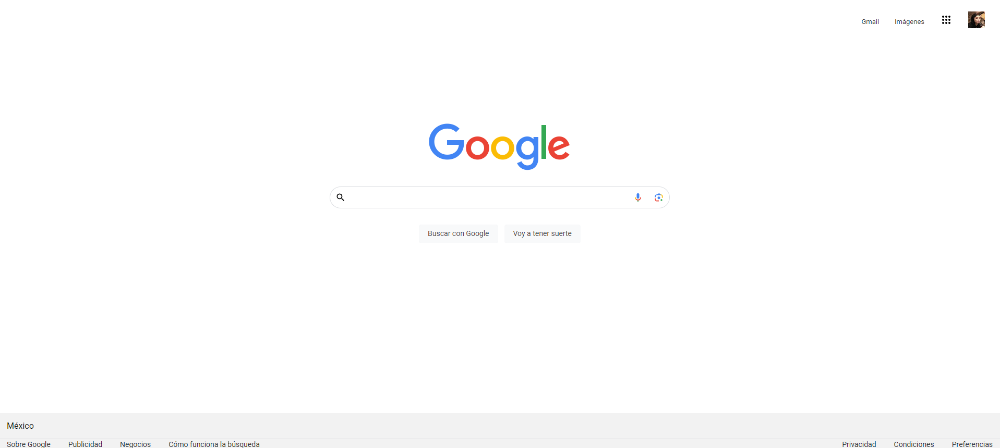

# Portafolio de habilidades en TECHNOLOCHICAS PRO

El presente proyecto es un clon de la página principal de Google desarrollado para poner en práctica las habilidades obtenidas dentro del bootcamp de desarrollo frontend de Technolochicas PRO.

Fue desarrollado con HTML y CSS, utilizando además bibliotecas externas.

La página es responsiva (adaptable a diferentes tamaños de pantalla) e incluye la presentación de la autora del proyecto.

[Proyecto Desplegado (https://clon-google-b7-g2-xi.vercel.app/)](https://clon-google-b7-g2-xi.vercel.app/)

## Secciones de sitio.

## Tecnologías.

* HTML
* CSS

———

Desarrollado por Karla Muñoz en el curso de TECHNOLOCHICAS PRO.